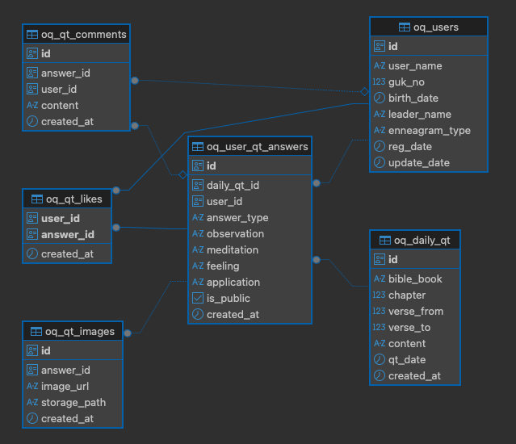

# OQ1 Backend (OQ1: One QT One Day)

OQ1 Backend 프로젝트는 하루 1개의 QT 본문을 중심으로, 사용자가 4단 구조(A~D 유형)의 묵상을 작성하고 피드 형태로 공유하는 공동체형 플랫폼을 위한 백엔드 서비스입니다.

---

## 1. 프로젝트 개요

- **프로젝트 명**: OQ1 (OQ1 Backend)
- **핵심 가치**: 
  - **하루 한 본문**: 매일 정해진 하나의 성경 본문을 묵상합니다.
  - **공동체 공유**: 묵상 내용을 피드 형태로 공유하고 '아멘(좋아요)'과 댓글로 격려합니다.
  - **4단 구조 묵상**: A형(느낀점)부터 D형까지 깊이 있는 묵상을 지원합니다.
  - **단순함**: 팔로우 기능 없이, 공동체 전체의 묵상을 나눕니다.

---

## 2. 기술 스택

- **Database**: PostgreSQL (Supabase)
- **Auth**: Supabase Auth (Kakao OAuth Only)
- **Storage**: Supabase Storage
- **Backend Logic**: Database Triggers, Functions (PL/pgSQL) & Next.js API Routes (Serverless)

---

## 3. 데이터베이스 구조 (Schema)

`supabase/schema.sql` 파일에 전체 스키마가 정의되어 있습니다.


### 주요 테이블
- **`oq_users`**: 사용자 프로필 정보. `auth.users` 테이블과 1:1 매핑됩니다. (비밀번호 없음, Kakao 로그인 전용)
- **`oq_daily_qt`**: 매일의 QT 본문 데이터. 날짜별로 유니크합니다.
- **`oq_user_qt_answers`**: 사용자가 작성한 묵상 데이터. (공개/비공개 설정 가능)
- **`oq_qt_images`**: 묵상에 첨부된 이미지 정보.
- **`oq_qt_likes / oq_qt_comments`**: 좋아요 및 댓글 상호작용.

### ERD (Entity Relationship Diagram)


### 보안 (RLS)
- 모든 테이블에 **Row Level Security (RLS)**가 적용되어 있습니다.
- 사용자는 자신의 데이터만 수정/삭제할 수 있습니다.
- `is_public` 필드에 따라 묵상 내용의 공개 여부가 결정됩니다.

---

## 4. 설치 및 설정 가이드

### 4.1. 사전 준비
1. Supabase 프로젝트 생성
2. Kakao Developers 애플리케이션 생성 및 Supabase Auth 연동 설정

### 4.2. 데이터베이스 초기화
프로젝트 루트의 `supabase/schema.sql` 파일을 실행하여 데이터베이스를 초기화합니다.

**방법 1: Supabase Dashboard 사용**
1. Supabase Dashboard > SQL Editor 접속
2. `New Query` 생성
3. `supabase/schema.sql` 내용 복사 및 붙여넣기
4. `Run` 버튼 클릭

**방법 2: Supabase CLI 사용 (권장)**
```bash
# 로그인
npx supabase login

# 프로젝트 링크 (Reference ID 입력)
npx supabase link --project-ref <project-ref>

# DB 초기화
npx supabase db push
```

### 4.3. 스토리지 설정
`schema.sql` 파일에 스토리지 버킷(`qt-images`) 생성 및 정책 설정 구문이 포함되어 있습니다. 단, Supabase 권한 설정에 따라 대시보드에서 추가 확인이 필요할 수 있습니다.

- **버킷 명**: `qt-images`
- **폴더 구조**: `qt-images/{user_id}/{answer_id}/filename.jpg`
- **접근 권한**: 
  - 읽기: 전체 공개 (Public)

  - 쓰기: 인증된 사용자 본인 폴더만 가능

---

## 5. 문서화 (Documentation)

- **API 문서**: Swagger(OpenAPI)를 사용하여 API 명세를 작성합니다.
- **배포**: 작성된 API 문서는 정적 페이지(Static HTML)로 변환하여 **GitHub Pages**를 통해 호스팅할 예정입니다.
- **접근**: (링크 예정)

---

## 6. 환경 설정 (.env)

프로젝트 루트에 `.env` 파일을 생성하고, `.env.example` 파일의 내용을 참고하여 Supabase 연결 정보를 입력해야 합니다.

1. `.env.example` 파일을 복사하여 `.env` 생성
   ```bash
   cp .env.example .env
   ```
2. Supabase Dashboard > Project Settings > API 에서 키 확인 후 입력
   - `NEXT_PUBLIC_SUPABASE_URL`: Project URL
   - `NEXT_PUBLIC_SUPABASE_ANON_KEY`: Project API keys (anon, public)
   - `SUPABASE_SERVICE_ROLE_KEY`: Project API keys (service_role, secret) **(주의: 클라이언트에 노출 금지)**

---

## 7. 관리자 기능 (참고)
관리자는 Supabase Dashboard를 통해 `oq_daily_qt` 테이블에 매일의 본문을 미리 입력해야 합니다. 향후 별도의 관리자 페이지나 스크립트가 제공될 예정입니다.

---

## 8. 상세 문서 (Detailed Documents)

프로젝트에 대한 더 상세한 아키텍처 설계 문서는 `docs/` 폴더에서 확인할 수 있습니다.

- **[인증 아키텍처 명세 (Auth Spec)](docs/OQ1_Auth_Architecture_Spec_v1.md)**
  - Supabase Auth 및 Kakao 로그인 연동 구조
  - 사용자 프로필(`oq_users`) 관리 정책 및 트리거 로직

- **[데이터베이스 아키텍처 명세 (DB Spec)](docs/OQ1_DB_Architecture_Spec_v1.md)**
  - 전체 테이블 스키마 및 컬럼 정의 상세
  - RLS(Row Level Security) 정책 및 데이터 무결성 규칙
  - 설계 철학 및 구현 제약사항

- **[에니어그램 테스트 명세 (Enneagram Test Spec)](docs/OQ1_Enneagram_Test_Spec_v1.md)**
  - 리소-허드슨 약식 테스트(Forced-Choice Pair) 문항 및 로직

- **[에니어그램 상세 테스트 명세 (RHETI Spec)](docs/OQ1_Enneagram_RHETI_Test_Spec_v1.md)**
  - 5점 척도(Likert Scale) 기반의 정밀 테스트 (135문항)
  - 유형별 점수 합산 및 날개(Wing) 추출 로직

- **[에니어그램 결과 명세 (Result Spec)](docs/OQ1_Enneagram_Result_Spec_v1.md)**
  - 테스트 결과 데이터 구조 및 유형별 상세 설명 템플릿
